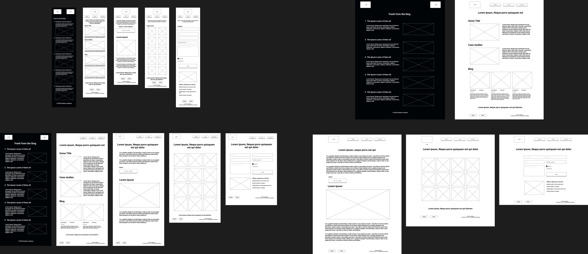

## Gustavo Jimenez T1A2

This is Gustavo Jimenez' Portfolio Website

A link (URL) to your published portfolio website

A link to your GitHub repo

A link to your presentation video

Description of your portfolio website, including,

Purpose

Functionality / features

Sitemap
## Guss Tech Portfolio website - sitemap

Screenshots
## Guss Tech Portfolio website - Responsive Design

Target audience
Guss Tech is a personal project. The main purpose of this site is to showcase what's been learnt during Term 1 and hopefully expose myself to further my knowledge by going deeper into more research and practice HTML and CSS

## Tech stack (e.g. html, css, deployment platform, etc)

**The main technologies used in this project are**

- Markdown language
- HTML
- CSS
- JavaScript 
    - only needed for the navigation menu activation