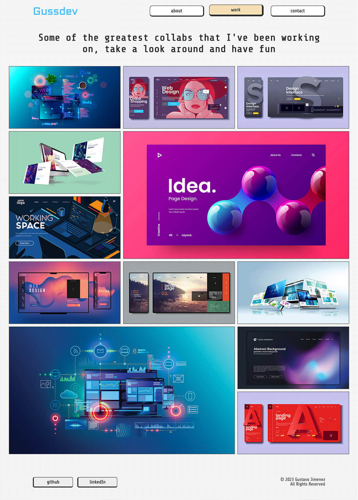
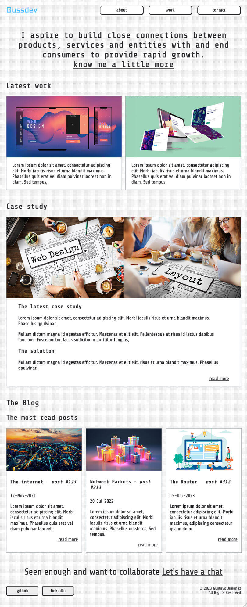
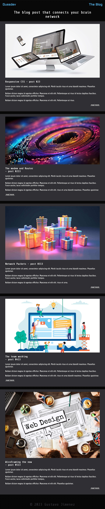

# Gustavo Jimenez T1A2
**This is Gustavo Jimenez' Portfolio website**
  
### A link (URL) to your published portfolio website
https://gustavojimenezt1a2.netlify.app/

### A link to your GitHub repo
https://github.com/Gus14939/GustavoJimenez_T1A2

### A link to your presentation video
https://gustavojimenezt1a2.netlify.app/assets/GustavoJimenez_T1A2_videoPresentation.mp4
## Description of the portfolio website:

### Purpose
Gussdev is an HTML/CSS portfolio project. The main purpose of this site is to showcase what's been learnt during Term 1 and hopefully expose myself to further my knowledge by digging deeper into more research and put it into practice in HTML and CSS

### Functionality / features

**Design:** The design of the website is visually appealing and professional. It highlights my work and skills. Minimalism is always a good option for a design like a portfolio, but also suits my style and personality.

**Navigation:** This website is very easy to navigate, with clear and concise menus that help visitors find what they’re looking for. While a sticky navigation could have been a good option I opted to keep it scrollable to have the content clean.

**Responsive design:** This portfolio website is optimised for all devices, including desktops, laptops, tablets, and smartphones. The components look great and functions well on any device.

**Portfolio:** I tried making the portfolio the centerpiece of the website. It meant to showcase my best work and highlight my skills and experience. While the content is fictional, this page is the most visually engaging of the site.

**Contact information:** I made it easy for visitors to contact me by including several link throughout the site. the contact page has key information like, email, address, phone number.

**Blog:** the blog helps establish me as an expert in the field and drive traffic to the website.

## sitemap

### Mobile Wireframe

### Tablet Wireframe

### Desktop Wireframe

_______
### Screenshots  
**Desktop**  

_______  
**Tablet**  

_______  
**Mobile**  

______
## Target audience
It is a personal project. However, I spend enough time to make it enjoyable and hopefully inspiring for other students. Teachers may also be part of the target audience. However, I think this site is mainly one part of a personal portfolio for CA partners to take interest in me as a prospective part of their team

## Tech stack (e.g. html, css, deployment platform, etc)
- Markup // Readme file and documentation
- HTML // Basic structure of the site
- CSS // styling for website 
- JS // for the mobile menu implementation
- Git and Github // Storing and Tracking the project
- Netlify // Website deployment